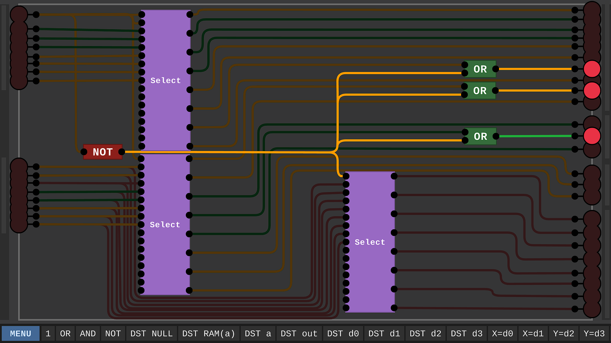
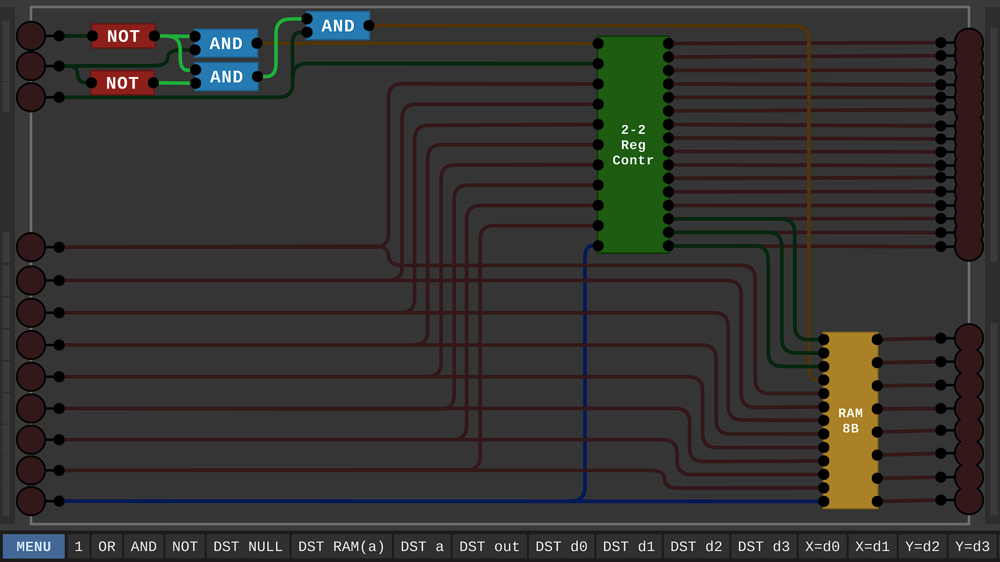

# Digital-Logic-Sim-Computer
8bit Computer built in Digital-Logic-Sim.

This is a project built in Sebastian Lagues [Digital-Logic-Sim](https://sebastian.itch.io/digital-logic-sim). It realizes a simple Computer that can run short programs. The Demo program implemented in the ROM currently is a Fibonacci-Series Calculator.

The architecture of this computer is based on the architecture of the computer realized in [Nandgame](https://www.nandgame.com/), but it has more registers, RAM and ROM.


## Specifications
- Precision: 8bit
- RAM: 8 Bytes
- Special Purpose Registers (RAM Adressing and Jumps): 1 (1 Byte)
- ROM: 8 Instructions (16 Bytes)
- General Purpose Registers: 4 (4 Bytes)
- Output-Register: 1 (1 Byte)
- Output: 3 digit decimal display (can be swapped for an octal display)

RAM and ROM could potentially be expanded, but these dimensions were sufficient for the demo program. In fact, the RAM is not used at all by the demo.

## How to run
Load the Component "COMPUTER FIB" and the demo program will start to run. You can control the speed of the clock via the two inputs on the left. The computed fibonacci series numbers will be displayed on the three 7-segment-displays.

## How to Program the computer
The computer can be programmed by changing the contents of the ROM. Currently, the ROM is contained in the components "ROM FIB 0-3" and "ROM FIB 4-7" which hold the code for the demo program. Each ROM component holds 4 Instructions, which have to be read in the order bottom right, top right, bottom left, top left. This is due to the how the "Instr Select" components work. I may flip this in the future to make it easier to read.

The Demo Program calculating the fibonacci numbers consists of the following code, which you can compare with the two following images:
```
0: D0 = 1
1: D2 = 1
2: A = 3 // for the jump instruction later
3: Out = D0 // start of loop
4: D1 = D0 + D2
5: D2 = D0
6: D0 = D1
7: JMP // Jump to wherever A is pointing (3 in this case)
```

Instructions 0 to 3:

Instructions 4 to 7:


Each Instruction consist of multiple components:
- Instruction Type: Either COMP-INS or DATA-INS
- Optional: Y-Source, either "Y=d2", "Y=d3" or "Y=RAM(a)". Only needed for Operations which use Y.
- Optional: X-Source, either "X=d0" or "X=d1". Only needed for Operation which use X.
- Operation: A wide range of operations is supported. These components start with "OP" and should be self-explanatory given their name. If not, you should refer to the Nandgame Documentation.
- Destination: Where to store the result. Available Options are "DST D0" - "DST D3" to store it in one of the D-Registers, "DST A", "DST RAM(A)", "DST Out" or "DST NULL" (to discard the result)
- Optional: Jump-Condition: The result of the operation will be checked against this Condition. If it is met, the Program Counter will be set whatever is currently stored in the A-Register (only the first 3 bits are currently relevant, since the ROM holds only 8 instructions).

## More Images
Arithmetic Logical Unit:


Instruction Decoder:


3bit to 7-Segment Decoder:


A-Register allows indirect adressing of RAM-contents:


8B-RAM Module realised by using two 4B-RAM Modules as subcomponents, which in turn use 2B-RAM Modules. This could be recursively repeated to reach 256B of RAM, which is the maximum address reachable with 8bit.

