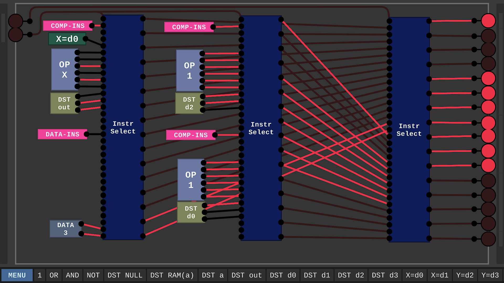

# Digital-Logic-Sim-Computer
8bit Computer built in Digital-Logic-Sim.

This is a project built in [Digital-Logic-Sim](https://sebastian.itch.io/digital-logic-sim) by Sebastian Lague. It realizes a simple Computer that can run short programs. The Demo program implemented in the ROM currently is a Fibonacci-Series Calculator.

The architecture of this computer closely follows the architecture of the computer realized in [Nandgame](https://www.nandgame.com/), but it has more registers, RAM and ROM.

## Specifications
- Precision: 8bit
- RAM: 8 Bytes
- ROM: 8 Instructions (16 Bytes)
- Registers: 3 (3 Bytes)
- Output: 3 digit octal display

RAM and ROM could potentially be expanded, but these dimensions were sufficient for the demo program. In fact, the RAM is not used at all by the demo.

## How to run
Load the Component "COMPUTER FIB" and the demo program will start to run. You can control the speed of the clock via the two inputs on the left. The computed fibonacci series numbers will be displayed on the three 7-segment-displays as octal numbers.

The Contents of the A-Register will be output to the display, while the content of the D1-Register can be used for jumps.

## How to Program the computer
The computer can be programmed by changing the contents of the ROM. Currently, the ROM is contained in the components "ROM FIB 0-3" and "ROM FIB 4-7" which hold the code for the demo program. Each ROM component holds 4 Instructions, which have to be read right to left, bottom to top due to the how the "SEL-INS" components work. I may flip this in the future to make it easier to understand.

Each Instruction consist of multiple components:
- Instruction Type: Either COMP-INS or DATA-INS
- Optional: X-Source, either "X=d1" or "X=d2" to select one of the D-Registers. Only needed for Operation which use X.
- Optional: Y-Source, either "Y=a" or "Y=RAM(a)" to select the A-Register or data from the RAM stored at the address which is currently in the A-Register. Only needed for Operations which use Y.
- Operation: A wide range of operations is supported. These components start with "OP" and should be self-explanatory given their name. If not, you should refer to the Nandgame Documentation.
- Destination: Where to store the result. Currently every result has to be saved. All components for this part start with "DST". Available Options are the registers or the RAM.
- Jump-Condition: Optional. The result of the operation will be checked against this Condition. If it is met, the Program Counter will be set whatever is currently stored in D1 (only the first 3 bits are currently relevant, since the ROM holds only 8 instructions).

## More Images
Arithmetic Logical Unit:

Instruction Decoder:

3bit BCD to 7-Segment Decoder:

A-Register allows indirect adressing of RAM-contents:

8B-RAM Module realised by using two 4B-RAM Modules as subcomponents, which in turn use 2B-RAM Modules. This could be recursively repeated to reach 256B of RAM, which is the maximum address reachable with 8bit.

